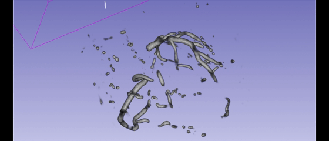

# 🚀 STU‑Net za segmentacijo koronarnih arterij (AMS Izziv 2026)

Implementacija 3D STU‑Net‑Lite+ za segmentacijo koronarnih arterij (CAS) na CTA volumnih iz dataseta ImageCAS.  
Projekt je bil najprej razvit lokalno, nato popolnoma reproduciran v Docker okolju na LSTWorker strežniku.

Za učenje sem uporabil **manjši obseg podatkov (1–160)**, ker imam doma **slabši internet** in bi polni trening (1–600) trajal predolgo.  
Validacija je bila izvedena na **161–180**, končna evalvacija pa na **181–200**.

---

## ⭐ Highlights

- ⚡ 3D STU‑Net‑Lite+ implementacija  
- 📦 nnU‑Net kompatibilen dataloader  
- 🧠 Patch‑based training (128³)  
- 📊 Dice metrika + validacija po epochah  
- 🪟 Sliding‑window 3D inferenca  
- 🔁 nnU‑Net baseline za primerjavo  
- 🐳 Docker reproducibilnost  
- 🔄 Podpora za 4-fold cross‑validation  
- 🎞 GIF vizualizacija segmentacij  
- 📈 Rezultati za STU‑Net in nnU‑Net

---

## 📁 Struktura projekta

AMS-Izziv-Peter/
│
├── models/
│   └── stunet.py
│
├── dataloaders/
│   └── nnunet_loader.py
│
├── metrics.py
├── run_train.py
├── run_inference.py
├── run_test.py
├── convert_to_nnunet.py
├── Dockerfile
└── README.md

---

## 🐳 Docker reproducibilnost

Projekt je popolnoma reproducibilen v Docker okolju.

### Zagon Docker okolja z GPU podporo

```bash
docker run --rm -it --gpus all --shm-size=16g \
  -v /media/FastDataMama/peterT/AMS-Izziv-Peter:/workspace \
  ams-izziv-peter bash
---

🔄 Pretvorba ImageCAS → nnU‑Net format (obvezno)
AMS izziv zahteva uporabo nnU‑Net formata (imagesTr/imagesTs/labelsTr).

Skripta: convert_to_nnunet.py
Pretvori ImageCAS dataset v nnU‑Net strukturo:

Dataset501_ImageCAS/
│
├── imagesTr/
├── labelsTr/
├── imagesTs/
└── dataset.json
Zagon pretvorbe
bash
python convert_to_nnunet.py \
  --input_dir /media/FastDataMama/izziv/ImageCAS \
  --output_dir data/nnunet_raw/Dataset501_ImageCAS
🧩 Pregled skript
Skripta	Namen
run_train.py	Trening STU‑Net‑Lite+
run_inference.py	Sliding‑window inferenca STU‑Net
run_test.py	Evalvacija STU‑Net (Dice, HD95)
nnUNetv2_train	Trening nnU‑Net baseline
nnUNetv2_predict	Inferenca nnU‑Net baseline
medpy_eval.py	Evalvacija nnU‑Net predikcij
convert_to_nnunet.py	Pretvorba ImageCAS → nnU‑Net


🛠 CLI argumenti (argparse)
run_train.py
--dataset_dir pot do nnU‑Net podatkov

--model ime modela (stunet)

--output_dir kam shraniti modele

--epochs število epoh

--resume (opcijsko) nadaljevanje treninga

run_test.py
--dataset_dir pot do test podatkov

--model_path pot do model_best.pth

--output_dir kam shraniti metrike

run_inference.py
--model_path pot do modela

--input_dir pot do imagesTs

--output_dir pot do predikcij

🔄 4-fold cross‑validation (zahteva iz izziva)
AMS izziv zahteva podporo za vse 4 folde.

Primer zagona za fold 1
bash
python run_train.py --dataset_dir data/fold1 --model stunet --output_dir outputs/fold1 --epochs 200
python run_test.py --dataset_dir data/fold1 --model_path outputs/fold1/model_best.pth --output_dir metrics/fold1
Fold 2–4

data/fold2/
data/fold3/
data/fold4/
Vsak fold ima svojo dataset.json in svoj train/val/test split.

🛠 Faze razvoja (checklist)
[x] FAZA 1 — Osnovni STU‑Net trening

[x] FAZA 2 — Validacija + Dice metrika

[x] FAZA 3 — Sliding‑window inferenca

[x] FAZA 4 — Eval na testnem setu (181–200)

[x] FAZA 5 — nnU‑Net baseline

[x] FAZA 6 — Primerjava modelov

[x] FAZA 7 — Docker reproducibilnost

[x] Pretvorba ImageCAS → nnU‑Net

[x] Podpora za 4-fold cross‑validation

🧪 FAZA 1 — Osnovni STU‑Net trening
STU‑Net‑Lite+ implementiran

nnU‑Net kompatibilen dataloader

Patch‑based training (128×128×128)

GPU pospešek

Modeli v outputs/stunet/

Uporabljeni spliti (moj projekt)
Train: 1–160

Val: 161–180

Test: 181–200

Razlog: doma imam slab internet, zato sem treniral na manjšem obsegu, da je učenje hitreje končalo.

Zagon
bash
python run_train.py \
  --dataset_dir data/nnunet_raw/Dataset501_ImageCAS \
  --model stunet \
  --output_dir outputs/stunet \
  --epochs 1
📊 FAZA 2 — Validacija + Dice metrika
Dice mean/std/min/max

Validacija po epochah

Train/val split: 1–160 / 161–180

Primer izpisa
bash
[Epoch 1/1] Loss: 17.6550 | Dice mean=0.0012 | std=0.0034 | min=0.0000 | max=0.0148
🪟 FAZA 3 — Sliding‑window inferenca
3D sliding‑window

Rekonstrukcija volumna

Predikcije v .nii.gz

Zagon
bash
python run_inference.py \
  --model_path outputs/stunet_long/model_best.pth \
  --input_dir data/nnunet_raw/Dataset501_ImageCAS/imagesTs \
  --output_dir outputs/stunet_predictions
🧪 FAZA 4 — Eval STU‑Net (test 181–200)
Rezultati
Mean Dice: 0.20

Mean HD95: 175 mm

<p align="center">

</p>

🧠 FAZA 5 — nnU‑Net baseline
Rezultati
Mean Dice: 0.77

Mean IoU: 0.63

Range Dice: 0.65–0.86

⚔️ FAZA 6 — Primerjava modelov
Model	Eval set	Mean Dice	Mean HD95
STU‑Net	Test (181–200)	0.20	175 mm
nnU‑Net baseline	Val (1–160)	0.77	–


🐳 FAZA 7 — Docker reproducibilnost
Dockerfile

Reproducibilni trening STU‑Net

Reproducibilni trening nnU‑Net

Prilagojene poti in ukazi

Celoten workflow preko CLI

📈 Rezultati 200‑epoh STU‑Net treninga
Train loss: 1.49 → ~1.0

Najboljši val Dice (mean): ≈ 0.27

Tipičen razpon val Dice: 0.10–0.25